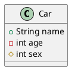
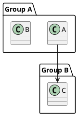

# plantUML

## intellj idea

```bash
# 1. idea安装插件 PlantUML
# 2. linux系统安装组件
sudo pacman -S graphviz
```

## 语法

### 访问修饰符

- `+` 表示 `public`
- `-` 表示 `private`
- `#` 表示 `protected`
- 不带符号表示 `default`



### 关系

- 继承： `--|>` `<|--`  实线 空三角箭头
- 实现： `..|>` `<|..`  虚线 空三角箭头
- 组合： `*--` `--*`  实线 实菱形箭头
- 聚合： `o--` `--o`  实线 空菱形箭头
- 关联： `-->` `<--`  实线 实三角箭头


### 分组

