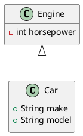

# plantUML

## intellj idea

```bash
# 1. idea安装插件 PlantUML
# 2. linux系统安装组件
sudo pacman -S graphviz
```

## 语法


**访问修饰符**

- `+` 表示 `public`
- `-` 表示 `private`
- `#` 表示 `protected`
- 不带符号表示 `default`

